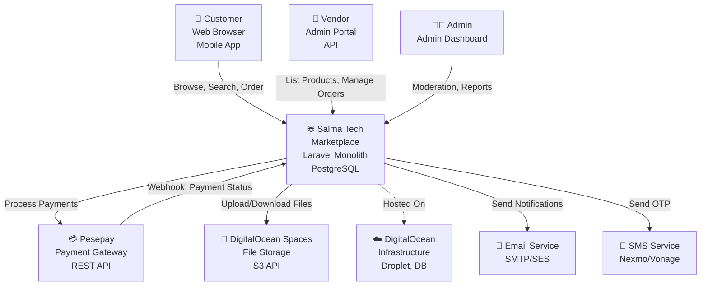
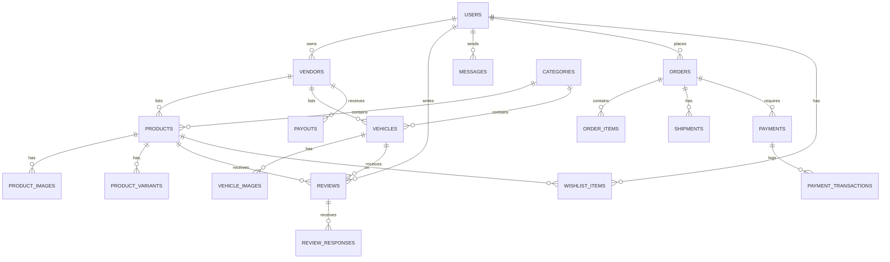
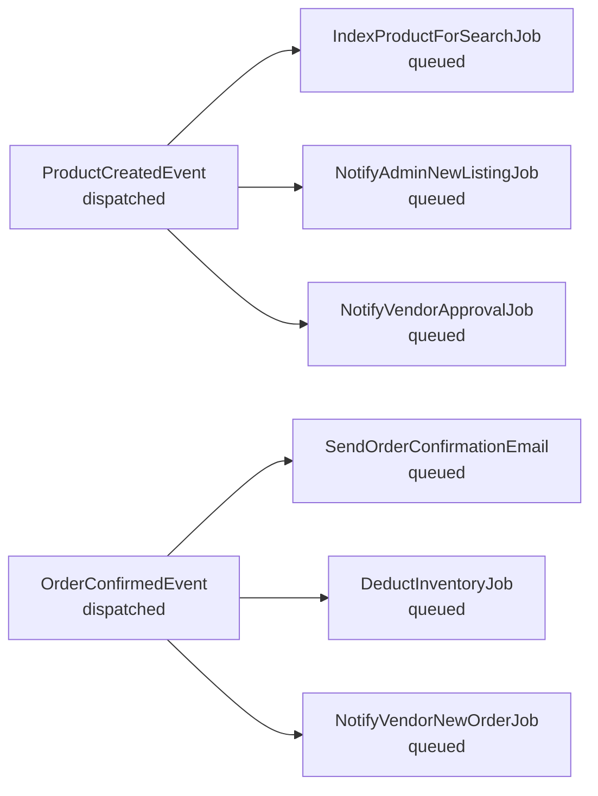
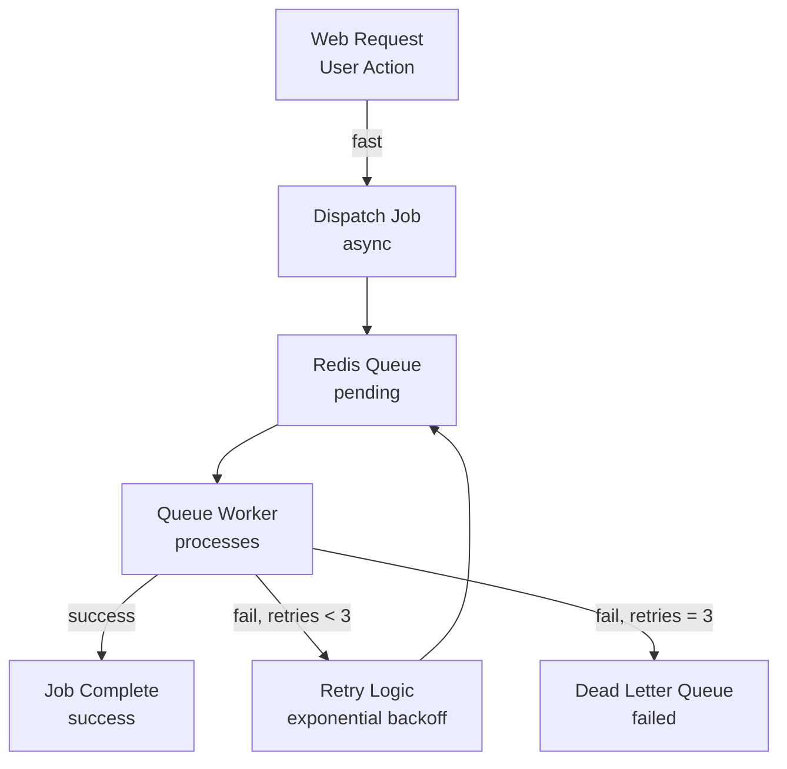
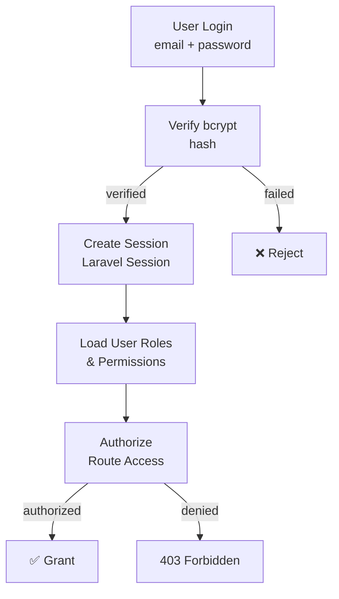

# Salma Tech Automotive Marketplace - System Architecture

## Overview

This document provides the technical blueprint for Salma Tech Automotive Marketplace. It describes the system design, module organization, data architecture, API design, and deployment topology.

---

## 1. High-Level System Context

### Context Diagram



---

## 2. Modular Monolith Architecture

### Directory Structure

```
laravel-marketplace/
├── app/
│   ├── Modules/
│   │   ├── Auth/                 # Authentication & authorization
│   │   ├── Users/                # User management
│   │   ├── Vendors/              # Vendor management
│   │   ├── Products/             # Product management
│   │   ├── Vehicles/             # Vehicle listings
│   │   ├── Categories/           # Category management
│   │   ├── Cart/                 # Shopping cart
│   │   ├── Orders/               # Order management
│   │   ├── Payments/             # Payment processing
│   │   ├── Shipping/             # Shipping management
│   │   ├── Reviews/              # Reviews & ratings
│   │   ├── Messages/             # Messaging system
│   │   ├── Notifications/        # Notification system
│   │   ├── Search/               # Search & filtering
│   │   ├── Wishlist/             # Wishlist
│   │   ├── Promotions/           # Promotions & coupons
│   │   ├── CMS/                  # CMS pages
│   │   ├── Reporting/            # Reports & analytics
│   │   ├── Audit/                # Audit logging
│   │   └── Settings/             # System settings
│   │
│   ├── Shared/                   # Shared code
│   │   ├── Contracts/            # Interfaces/contracts
│   │   ├── Exceptions/           # Custom exceptions
│   │   ├── Services/             # Shared services
│   │   ├── Traits/               # Reusable traits
│   │   ├── Guards/               # Auth guards
│   │   ├── Middleware/           # Global middleware
│   │   ├── Events/               # Domain events
│   │   └── Casts/                # Custom model casts
│   │
│   ├── Console/                  # Artisan commands
│   ├── Exceptions/               # Global exception handling
│   └── Providers/                # Service providers
│
├── database/
│   ├── migrations/               # Database migrations
│   ├── seeders/                  # Database seeders
│   └── factories/                # Model factories
│
├── resources/
│   ├── views/
│   │   ├── layouts/              # Master layouts
│   │   ├── auth/                 # Auth views
│   │   ├── customer/             # Customer views
│   │   ├── vendor/               # Vendor portal views
│   │   ├── admin/                # Admin dashboard views
│   │   └── emails/               # Email templates
│   ├── css/                      # TailwindCSS
│   └── js/                       # Alpine.js components
│
├── routes/
│   ├── api.php                   # API routes (future)
│   ├── web.php                   # Web routes
│   ├── admin.php                 # Admin routes
│   └── vendor.php                # Vendor routes
│
├── config/
├── storage/
├── tests/
│   ├── Unit/
│   ├── Feature/
│   └── Fixtures/
│
└── docker/
    ├── Dockerfile
    ├── docker-compose.yml
    └── nginx/
        └── nginx.conf
```

### Module Structure (Per Module)

```
Modules/Products/
├── Actions/
│   ├── CreateProductAction.php
│   ├── UpdateProductAction.php
│   └── DeleteProductAction.php
├── Events/
│   ├── ProductCreatedEvent.php
│   ├── ProductUpdatedEvent.php
│   └── ProductListingApprovedEvent.php
├── Listeners/
│   ├── NotifyVendorOnApprovalListener.php
│   └── IndexProductForSearchListener.php
├── Models/
│   ├── Product.php
│   ├── ProductImage.php
│   └── ProductVariant.php
├── Repositories/
│   ├── ProductRepositoryInterface.php
│   └── ProductRepository.php
├── Services/
│   ├── ProductServiceInterface.php
│   ├── ProductService.php
│   └── ProductApprovalService.php
├── Requests/
│   ├── StoreProductRequest.php
│   ├── UpdateProductRequest.php
│   └── BulkImportProductRequest.php
├── Resources/
│   ├── ProductResource.php
│   └── ProductDetailResource.php
├── Controllers/
│   ├── ProductController.php
│   └── ProductApprovalController.php
├── Jobs/
│   ├── ProcessProductImageJob.php
│   ├── IndexProductForSearchJob.php
│   └── GenerateProductThumbnailJob.php
├── Routes/
│   └── routes.php
├── Database/
│   └── Migrations/
└── Tests/
    ├── Unit/
    ├── Feature/
    └── Fixtures/
```

---

## 3. Database Architecture

### Entity-Relationship Diagram (Core)



### Schema Summary (PostgreSQL)

#### Core Tables

| Table | Purpose | Key Fields |
|-------|---------|-----------|
| **users** | User accounts | id(UUID), email, password_hash, phone, verified_at, role, deleted_at |
| **vendors** | Seller accounts | id(UUID), user_id, business_name, business_registration, tax_id, status, tier, commission_rate |
| **vendor_bank_accounts** | Vendor payouts | id(UUID), vendor_id, account_number, bank_name, account_holder, verified_at |
| **products** | Product listings | id(UUID), vendor_id, category_id, title, description, sku, price_zwl, price_usd, quantity, status |
| **product_images** | Product photos | id(UUID), product_id, image_path, display_order, created_at |
| **vehicles** | Vehicle listings | id(UUID), vendor_id, year, make, model, body_type, transmission, fuel_type, mileage, vin, condition, status |
| **categories** | Product categories | id(UUID), parent_id, name, slug, description, icon, commission_override |
| **orders** | Customer orders | id(UUID), customer_id, status, total_amount_zwl, total_amount_usd, created_at |
| **order_items** | Items in order | id(UUID), order_id, product_id, vendor_id, quantity, unit_price, total_price |
| **payments** | Payment records | id(UUID), order_id, amount, currency, status, pesepay_transaction_id, created_at |
| **shipments** | Shipping info | id(UUID), order_id, vendor_id, status, shipping_method, tracking_number, shipped_at, delivered_at |
| **reviews** | Customer reviews | id(UUID), reviewer_id, product_id/vendor_id, rating, title, comment, status, created_at |
| **carts** | Shopping carts | id(UUID), customer_id, updated_at |
| **cart_items** | Items in cart | id(UUID), cart_id, product_id, quantity |
| **wishlist_items** | Wishlist items | id(UUID), customer_id, product_id, created_at |
| **messages** | Customer messages | id(UUID), sender_id, recipient_id, subject, body, read_at |
| **notifications** | User notifications | id(UUID), user_id, type, data, read_at, created_at |
| **audit_logs** | Audit trail | id(UUID), user_id, action, resource_type, resource_id, old_values, new_values, created_at |
| **promotions** | Admin promotions | id(UUID), name, type, discount_value, min_order_value, category_id, status, start_date, end_date |
| **coupons** | Coupon codes | id(UUID), code, promotion_id, max_uses, used_count, expires_at |
| **coupon_usage** | Coupon redemptions | id(UUID), coupon_id, customer_id, order_id, redeemed_at |

### Database Design Principles

- **UUIDs**: Primary key for all tables (not auto-increment integers)
- **Soft Deletes**: `deleted_at` timestamps on users, products, vendors
- **Timestamps**: `created_at`, `updated_at` on all tables
- **Foreign Keys**: ON DELETE CASCADE for logical deletions, ON DELETE RESTRICT for safety
- **Indexing**: Indexes on frequently queried columns (email, vendor_id, category_id)
- **Partitioning**: Orders table partitioned by month (if >1M rows)

### Search Index Strategy

**Elasticsearch/PostgreSQL Full-Text Search** (Phase 1 uses PostgreSQL, Phase 2+ may add Elasticsearch)

```
tsvector Columns:
- products.search_vector (title || description)
- vehicles.search_vector (make || model || color)

GIN Indexes:
- CREATE INDEX products_search_idx ON products USING gin(search_vector);

Triggers:
- Before insert/update: Automatically update tsvector
```

---

## 4. Service Layer Architecture

### Service Directory & Responsibilities

```
app/Shared/Services/
├── Authentication/
│   ├── AuthenticationService.php
│   ├── PasswordResetService.php
│   └── TwoFactorService.php
├── Payments/
│   ├── PaymentProcessingService.php
│   ├── PesepayGatewayService.php
│   ├── RefundService.php
│   └── PayoutService.php
├── Notifications/
│   ├── NotificationService.php
│   ├── EmailService.php
│   └── SMSService.php
├── Storage/
│   ├── FileUploadService.php
│   ├── ImageProcessingService.php
│   └── DigitalOceanSpacesService.php
├── Search/
│   ├── SearchService.php
│   ├── SearchIndexingService.php
│   └── FilteringService.php
├── Reporting/
│   ├── ReportingService.php
│   ├── AnalyticsService.php
│   └── ExportService.php
├── Moderation/
│   ├── ContentModerationService.php
│   ├── SpamDetectionService.php
│   └── AbuseReportingService.php
└── Security/
    ├── EncryptionService.php
    ├── TokenService.php
    ├── AuditLoggingService.php
    └── FraudDetectionService.php
```

### Key Services & Interfaces

#### Payment Processing Service

```php
interface PaymentProcessingService
{
    public function processPayment(PaymentRequest $request): PaymentResult;
    public function refund(Payment $payment, ?float $amount = null): RefundResult;
    public function getPaymentStatus(string $transactionId): PaymentStatus;
    public function validateCard(CardDetails $card): bool;
}
```

#### Notification Service

```php
interface NotificationService
{
    public function send(Notification $notification, array $channels): NotificationResult;
    public function sendEmail(EmailNotification $notification): bool;
    public function sendSMS(SMSNotification $notification): bool;
    public function sendInApp(InAppNotification $notification): bool;
}
```

#### Search Service

```php
interface SearchService
{
    public function search(SearchQuery $query, SearchFilters $filters): SearchResults;
    public function indexDocument(Searchable $item): bool;
    public function removeDocument(Searchable $item): bool;
    public function suggest(string $query): Suggestions;
}
```

---

## 5. Repository Pattern

### Repository Abstraction

```php
interface ProductRepository
{
    public function find(string $id): ?Product;
    public function findBySku(string $sku, string $vendorId): ?Product;
    public function findByVendor(string $vendorId, ?string $status = null): Collection;
    public function findByCategory(string $categoryId, array $filters): Paginator;
    public function create(array $attributes): Product;
    public function update(Product $product, array $attributes): bool;
    public function delete(Product $product): bool;
}

// Implementation
class ProductRepository implements ProductRepository
{
    public function __construct(private Product $model) {}
    
    public function find(string $id): ?Product
    {
        return $this->model->where('id', $id)
            ->where('deleted_at', null)
            ->with('images', 'vendor', 'category')
            ->first();
    }
    
    public function findByVendor(string $vendorId, ?string $status = null): Collection
    {
        $query = $this->model->where('vendor_id', $vendorId)
            ->where('deleted_at', null);
            
        if ($status) {
            $query->where('status', $status);
        }
        
        return $query->with('images')->get();
    }
}
```

**Benefits**:
- Easy to test (mock repositories)
- Can swap implementations (DB → API)
- Business logic decoupled from data access

---

## 6. API Architecture (RESTful)

### API Endpoints (Phase 2+)

```
/api/v1/
├── /auth
│   ├── POST   /register
│   ├── POST   /login
│   ├── POST   /logout
│   ├── POST   /refresh-token
│   └── POST   /password-reset
├── /products
│   ├── GET    /products              (list + search)
│   ├── GET    /products/{id}         (detail)
│   ├── POST   /products              (create)
│   ├── PUT    /products/{id}         (update)
│   ├── DELETE /products/{id}         (delete)
│   └── GET    /products/{id}/reviews (product reviews)
├── /vehicles
│   ├── GET    /vehicles              (list + search)
│   ├── GET    /vehicles/{id}         (detail)
│   ├── POST   /vehicles              (create)
│   └── PUT    /vehicles/{id}         (update)
├── /orders
│   ├── GET    /orders                (customer's orders)
│   ├── GET    /orders/{id}           (order detail)
│   ├── POST   /orders                (create order)
│   └── PUT    /orders/{id}/status    (update status)
├── /cart
│   ├── GET    /cart                  (view cart)
│   ├── POST   /cart                  (add item)
│   ├── PUT    /cart/{itemId}         (update quantity)
│   └── DELETE /cart/{itemId}         (remove item)
├── /vendors
│   ├── GET    /vendors/{id}          (vendor profile)
│   ├── GET    /vendors/{id}/products (vendor products)
│   └── GET    /vendors/{id}/reviews  (vendor reviews)
└── /search
    └── GET    /search?q=...&filters...
```

### API Response Format (JSON)

```json
{
  "success": true,
  "data": { ... } or [...],
  "meta": {
    "pagination": {
      "page": 1,
      "per_page": 20,
      "total": 100,
      "pages": 5
    }
  },
  "message": null
}
```

### API Resource Classes (Serialization)

```php
class ProductResource extends JsonResource
{
    public function toArray($request)
    {
        return [
            'id' => $this->id,
            'title' => $this->title,
            'price' => [
                'zwl' => number_format($this->price_zwl, 2),
                'usd' => number_format($this->price_usd, 2),
            ],
            'images' => ProductImageResource::collection($this->images),
            'vendor' => new VendorSummaryResource($this->vendor),
            'rating' => $this->average_rating,
        ];
    }
}
```

---

## 7. Event-Driven Architecture

### Domain Events



### Event Listeners

```php
// Event definition
class ProductCreatedEvent implements ShouldBroadcast
{
    public function __construct(
        public Product $product,
        public User $createdBy
    ) {}
}

// Listeners
class IndexProductListener
{
    public function handle(ProductCreatedEvent $event)
    {
        dispatch(new IndexProductForSearchJob($event->product));
    }
}

class NotifyAdminListener
{
    public function handle(ProductCreatedEvent $event)
    {
        Notification::send(Admin::all(), new ProductPendingApprovalNotification($event->product));
    }
}

// Register in EventServiceProvider
protected $listen = [
    ProductCreatedEvent::class => [
        IndexProductListener::class,
        NotifyAdminListener::class,
    ],
];
```

---

## 8. Queue Architecture

### Job Processing Pipeline



### Key Background Jobs

| Job | Queue | Timeout | Retries |
|-----|-------|---------|---------|
| **ProcessProductImageJob** | images | 30s | 3 |
| **IndexProductForSearchJob** | search | 10s | 1 |
| **SendNotificationEmailJob** | emails | 30s | 5 |
| **ProcessPaymentJob** | payments | 60s | 3 |
| **GenerateReportJob** | reports | 300s | 1 |
| **SyncInventoryJob** | inventory | 60s | 2 |
| **GeneratePayoutJob** | payouts | 120s | 2 |

---

## 9. Caching Strategy

### Cache Layers

```
Request
  ↓
[Browser Cache - 24h]
  ↓
[HTTP Cache - ETag/Last-Modified]
  ↓
[Redis Query Cache - 5m]
  ↓
[Database]
```

### Cache Keys Strategy

```php
// Product listing
Cache::get("products:category:electronics:page:1")

// Product detail
Cache::get("product:{id}") // 1 hour

// Vendor profile
Cache::get("vendor:{id}") // 30 minutes

// Search results
Cache::get("search:category:{id}:price_range:{min}:{max}") // 5 minutes

// User cart
Cache::get("cart:{user_id}") // Session duration

// Seller ratings
Cache::get("vendor:{id}:rating") // 24 hours
```

### Cache Invalidation Events

| Event | Cache Keys Invalidated |
|-------|------------------------|
| **Product Updated** | product:{id}, products:category:{id}, search:* |
| **Review Added** | vendor:{id}:rating, product:{id}:reviews |
| **Inventory Changed** | product:{id}, search:* |
| **Vendor Profile Updated** | vendor:{id} |
| **Price Changed** | product:{id}, search:* |

---

## 10. Security Architecture

### Authentication & Authorization Flow



### Security Middleware Stack

```php
// routes/web.php
Route::middleware(['web'])->group(function () {
    Route::middleware(['auth'])->group(function () {
        Route::middleware(['verify.email'])->group(function () {
            Route::middleware(['throttle:60,1'])->group(function () {
                // Protected routes
            });
        });
    });
});

// Middleware order:
1. VerifyCsrfToken (CSRF protection)
2. CheckForMaintenanceMode (APP_DEBUG)
3. TrustProxies (DigitalOcean load balancer)
4. ConvertEmptyStringsToNull
5. TrimStrings
6. EncryptCookies
7. AddQueuedCookiesToResponse
8. StartSession
9. AuthenticateSession (prevent fixation)
10. ShareErrorsFromSession
11. VerifyCsrfToken
```

### Data Encryption

```php
// Sensitive fields
protected $encrypted = [
    'ssn',           // Government ID
    'bank_account',  // Bank account number
    'pesepay_token', // Pesepay token
];

// Custom encryption
use EncryptedAttribute;

public $casts = [
    'ssn' => EncryptedAttribute::class,
];
```

---

## 11. Logging & Monitoring

### Logging Strategy

```
App logs → Local Storage (dev) + External Service (prod)
         → Daily rotation
         → Structured logging (JSON)
         → Indexed for searching
```

### Log Channels (config/logging.php)

```php
'channels' => [
    'single' => [
        'driver' => 'single',
        'path' => storage_path('logs/laravel.log'),
        'level' => 'debug',
    ],
    'payments' => [
        'driver' => 'single',
        'path' => storage_path('logs/payments.log'),
        'level' => 'info',
    ],
    'security' => [
        'driver' => 'single',
        'path' => storage_path('logs/security.log'),
        'level' => 'warning',
    ],
    'sentry' => [
        'driver' => 'sentry',
        'level' => 'error',
    ],
]
```

### Monitorable Events

| Event | Severity | Alert Threshold |
|-------|----------|-----------------|
| **Failed Login** | Warning | 5+ in 15 minutes |
| **Payment Failed** | Warning | 3+ in 1 hour |
| **Database Error** | Critical | 1+ occurrence |
| **API Timeout** | Warning | >5% of requests |
| **High Memory Usage** | Critical | >90% |
| **Disk Space Low** | Critical | <10% free |
| **Payment Dispute** | Warning | 1+ occurrence |
| **Content Moderation Flag** | Info | Log for review |

---

## 12. Docker Architecture

### Docker Image Layers

```dockerfile
# Multi-stage build
FROM php:8.2-fpm-alpine AS builder
WORKDIR /app
COPY . .
RUN composer install --no-dev --optimize-autoloader

FROM php:8.2-fpm-alpine
WORKDIR /app
COPY --from=builder /app /app

# Configuration
COPY docker/php-fpm.conf /usr/local/etc/php-fpm.conf
COPY docker/php.ini /usr/local/etc/php/conf.d/app.ini

# Healthcheck
HEALTHCHECK --interval=30s --timeout=10s --start-period=5s \
  CMD php -r 'file_exists(".env") || exit(1);' || exit 1

EXPOSE 9000
CMD ["php-fpm"]
```

### Docker Compose Stack

```yaml
version: '3.8'

services:
  app:
    build:
      context: .
      dockerfile: docker/Dockerfile
    working_dir: /app
    environment:
      - DB_HOST=postgres
      - DB_DATABASE=salma_marketplace
      - REDIS_HOST=redis
      - CACHE_DRIVER=redis
      - QUEUE_CONNECTION=redis
    ports:
      - "9000:9000"
    depends_on:
      - postgres
      - redis
    volumes:
      - .:/app
      - app_storage:/app/storage

  nginx:
    image: nginx:alpine
    ports:
      - "80:80"
      - "443:443"
    volumes:
      - .:/app
      - docker/nginx.conf:/etc/nginx/nginx.conf:ro
      - ./ssl:/etc/nginx/ssl:ro
    depends_on:
      - app

  postgres:
    image: postgres:15-alpine
    environment:
      - POSTGRES_DB=salma_marketplace
      - POSTGRES_USER=marketplace
      - POSTGRES_PASSWORD=secure_password
    volumes:
      - postgres_data:/var/lib/postgresql/data
    ports:
      - "5432:5432"

  redis:
    image: redis:7-alpine
    ports:
      - "6379:6379"
    volumes:
      - redis_data:/data

  queue-worker:
    build:
      context: .
      dockerfile: docker/Dockerfile
    command: php artisan queue:work --tries=3 --delay=3
    depends_on:
      - postgres
      - redis
    environment:
      - DB_HOST=postgres
      - REDIS_HOST=redis

volumes:
  postgres_data:
  redis_data:
  app_storage:
```

---

## 13. Deployment Topology

### Production Stack

```
Internet Traffic
    ↓
[CloudFlare / CDN]
    ↓
[DigitalOcean Firewall]
    ↓
[Nginx Reverse Proxy]
    ↓
[PHP-FPM (Docker)]
    ↓
[PostgreSQL Database]
    ↓
[Redis (Cache + Queue)]
    ↓
[DigitalOcean Spaces (S3)]
```

### High Availability (Future)

```
Load Balancer (DigitalOcean LB)
├── [Server 1] PHP-FPM + App
├── [Server 2] PHP-FPM + App
├── [Server 3] PHP-FPM + App
│
Database Cluster (PostgreSQL HA)
├── Primary (read-write)
├── Replica 1 (read-only)
└── Replica 2 (read-only)
│
Redis Sentinel Cluster
├── Master (cache + queue)
├── Replica 1
└── Replica 2
│
S3 Storage (Geo-redundant)
```

---

## 14. Performance Optimization

### Frontend Optimization

```
HTML Compression: gzip 85%+
CSS Minification: TailwindCSS purged
JavaScript: Alpine.js (minimal, loaded inline)
Images: WebP format, lazy loading, responsive srcset
Caching: Browser cache 30 days for assets
CDN: DigitalOcean Spaces + CloudFlare
HTTP/2: Enabled on Nginx
```

### Backend Optimization

```
Database:
- Query optimization (indexes on vendor_id, category_id)
- N+1 query prevention (eager loading)
- Query result caching (5m for lists)

API Response:
- Pagination (20 items/page default)
- Sparse fieldsets (only requested columns)
- Response compression (gzip)

Background Jobs:
- Async processing for notifications, images, reports
- Rate limiting (prevent queue overload)
- Graceful degradation (soft failures logged)
```

---

## 15. Scalability Roadmap

### Phase 1: Single Droplet
- Single DigitalOcean Droplet (2GB RAM, 2vCPU)
- PostgreSQL on-server
- Redis on-server
- Sufficient for ~50k users, ~5k monthly orders

### Phase 2: Multi-Tier (10k+ monthly orders)
- App server: Upgraded to 4GB RAM
- Database: Separate managed PostgreSQL instance
- Cache: Separate Redis instance
- Load testing: Identify bottlenecks

### Phase 3: Multi-Server (50k+ monthly orders)
- Load balancer (round-robin)
- 3x app servers
- PostgreSQL cluster with replication
- Redis Sentinel for high availability
- Elasticsearch for full-text search

### Phase 4: Kubernetes (100k+ monthly orders)
- Migrate to DigitalOcean Kubernetes
- Horizontal pod autoscaling
- Service mesh (Istio)
- Event streaming (Kafka)
- Microservices (if needed)

---

## 16. Security Best Practices

### OWASP Top 10 Mitigations

| Vulnerability | Mitigation |
|---|---|
| **Injection** | Prepared statements (Eloquent ORM), input validation |
| **Broken Auth** | bcrypt hashing, secure session management, MFA (Phase 2) |
| **Sensitive Data Exposure** | HTTPS/TLS, field encryption, .env secrets |
| **XML External Entities** | Disable external entity parsing, use JSON |
| **Broken Access Control** | RBAC middleware, policy authorization |
| **Security Misconfiguration** | Security headers, disabled debug mode, dependencies updated |
| **XSS** | Blade escaping, CSP headers, input sanitization |
| **CSRF** | CSRF tokens on all forms, SameSite cookies |
| **Using Components with Known Vulnerabilities** | Composer audit, dependency scanning |
| **Insufficient Logging & Monitoring** | Structured logging, Sentry alerts, audit logs |

### HTTP Security Headers

```nginx
# nginx.conf
add_header Strict-Transport-Security "max-age=31536000; includeSubDomains" always;
add_header X-Content-Type-Options "nosniff" always;
add_header X-Frame-Options "SAMEORIGIN" always;
add_header X-XSS-Protection "1; mode=block" always;
add_header Referrer-Policy "strict-origin-when-cross-origin" always;
add_header Content-Security-Policy "default-src 'self'; script-src 'self' 'unsafe-inline'" always;
```

---

## Appendix: Technology Justification

### Why Laravel 12 LTS?
- **Maturity**: 10+ years, battle-tested
- **Ecosystem**: Extensive packages (Cashier, Nova, Horizon, Telescope)
- **Security**: Automatic CSRF, XSS protection
- **ORM**: Eloquent is intuitive and powerful
- **Team Productivity**: Conventions reduce boilerplate
- **Longevity**: LTS versions supported 3 years

### Why PostgreSQL over MySQL?
- **JSON Support**: Better for variant attributes (vehicle options)
- **Full-Text Search**: Native, no separate service
- **ACID Guarantees**: Stricter constraints
- **Range Types**: Useful for price filtering
- **Window Functions**: Analytics queries
- **Better Scaling**: More efficient with concurrent writes

### Why Docker?
- **Development Parity**: Dev environment matches production exactly
- **Dependency Isolation**: No system-wide installation issues
- **Easy Onboarding**: New developers: `docker-compose up`
- **Deployment Consistency**: Same image from dev to production
- **Scaling**: Easier to add/remove containers

---

*Document Version: 1.0*  
*Last Updated: 2026*  
*Status: Approved*
